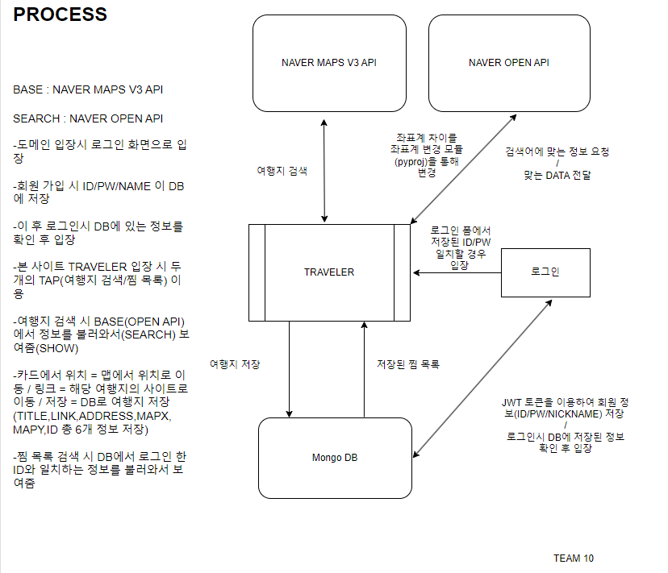
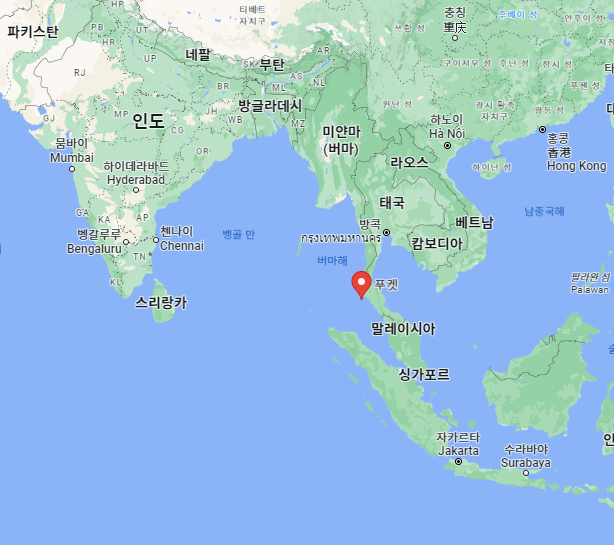

# TRAVELER - 항해15기 10조 미니 프로젝트 발표

---

# **TRAVELER**

- 코로나가 서서히 종식되며 증가하는 여행 수요를 위해 내가 관심 있는 검색어를 입력하면 장소를 추천해주고 장소를 찜 등록하여 저장할 수 있는 프로젝트입니다.

---

## 와이어 프레임




- 기능 상세 설명
    - 원하는 여행지를 검색하고 가고 싶은 곳을 저장하여 ‘찜’  할 수 있도록 구현
    - 여행지 검색 시 검색에 맞는 곳의 ‘명칭’ , ‘주소’ , ‘사이트’ 를 볼 수 있고 원하는 곳을 클릭 시 마커가 찍히며 그에 맞게 지도 이동
    - 회원가입 후 로그인을 통해 본인이 지정한 찜 목록을 살펴보고 WISHLIST 처럼 완료 후엔 삭제할 수 있도록 제작
    - 지도는 네이버 지도를 기준으로 제작되었으며 우측 상단의 +/-버튼이나 마우스 휠을 통해 확대 비율을 조절
    - MongoDB를 통한 찜 목록, 회원 정보 관리

---

## RESTful API설계

[API설계](https://www.notion.so/a84e8f1f717b45bfac19223ca4a62790?pvs=21)

## Troubleshooting

1. Naver 지도 및 검색 API 구현
- Naver 검색 API를 활용하여 여행지 검색 구현
- Naver Cloud Platform를 이용하여 네이버 지도 Web Dynamic Map 구현
- Naver Maps API v3 Doc을 참고하여 Javascript 구현

[NAVER Maps API v3](https://navermaps.github.io/maps.js/)

1. Naver Map 좌표계와 검색 API 좌표계 호환 문제
- Naver Map 좌표계는 ****WGS84(위도, 경도)****를 사용하지만, 검색 API를 통해 나온 위치 좌표는 TM128(katech) 좌표계를 사용
- pyproj이라는 좌표계 변경 모듈을 사용하여 TM128 → WGS84 로 좌표계 변경

1. DB 구축 및 API 설계
- 웹종에서 배운 MongoDB를 활용하여 찜 목록 DB 구축

| Key | 설명 |
| --- | --- |
| ID | ID 별로 저장 목록을 확인 할 수 있도록 ID 저장 |
| Title | 검색한 장소 이름 |
| link | 검색한 장소 홈페이지 |
| address | 검색한 장소의 주소 |
| mapx | 검색한 장소의 X 좌표(WGS84) |
| mapy | 검색한 장소의 Y 좌표(WGS84) |
- 저장된 목록의 위치를 볼 수 있도록 mapx, mapy 좌표계를 추가 저장
- 장소 저장 및 저장한 장소를 불러올 수 있도록 API 설계 및 구현

1. JWT 쿠키 문제 
- 초기에 로그인, 회원 가입 기능 개발 시 회원 관리에 대한 URL을 /member/~ 의 형태로 작성하였고  로그인시 쿠키에 JWT를 저장하였다. 하지만 로그인을 성공하여 로그인 성공 메시지가 출력되어도 ‘/’로 이동하면 쿠키가 없어져 다시 로그인 페이지로 넘어가는 오류가 발생하였다.
- 토큰의 Path가 /member로 되어있어 /에서는 토큰을 얻지 못하여 로그인 정보가 없다는 오류가 발생하였고 이를 해결하기 위해 로그인 페이지로 이동시켜주는 api의 URL을 /login으로 변경해주었다.

-변경 전


-변경 후


1. 웹 페이지 디자인 시 문제 점
- 지도 옆 Infomation 공간이 부족한 점 발견(위치 검색과 저장 목록을 두개 다 출력할 시 공간 부족 발생)
- 위치 검색 버튼과 찜 목록 버튼 구현

| 위치 검색 버튼 클릭 시 | 찜 목록 버튼 클릭 시 |
| --- | --- |
| 여행지 검색창으로 검색 변경 | 찜 목록 검색창 으로 검색 변경 |
| 여행지 검색 시 Search list 출력 | 찜 목록 list 출력 & 찜 목록 검색 시 DB 내 Search list 출력 |


찜 목록 버튼 클릭 시 출력 화면


위치 검색 버튼 클릭 시 출력 화면

- 위치 String의 내용이 Div 보다 긴 경우 String 겹침 현상 발생


위치 String이 Card Div 보다 길어서, 겹침 현상 발생

- CSS에서 해당 Class에 생략 기능 구현 (Googling)

```css
overflow: hidden;
  text-overflow: ellipsis;
  white-space: nowrap;
  width : 350px;
  height : 20px;
```

---

## RESULT


---

## 회고록

1. 검색 관련 카드들이 나올 때 여러 개를 보기 위해 리스트 형식으로 두고 스크롤을 쓰고 싶었으나 기능 구현의 한계로 검색 결과를 5개로 제한함


1. 지도 애니메이터 무빙 효과
    
    
    
2. 검색 결과 중 ‘ADDRESS’의 경우 길면 글자가 아랫줄로 밀리며 겹쳐지는 현상 보완


1. 찜한 목록의 위치 지도에 새로운 마커 아이콘으로 고정
2. NAVER MAPS API 사용으로 인한 국내 여행지로 검색 제한
3. 클린 코드 작성의 필요성

## Public Github Repository

[https://github.com/traveler-15/traveler](https://github.com/traveler-15/traveler)